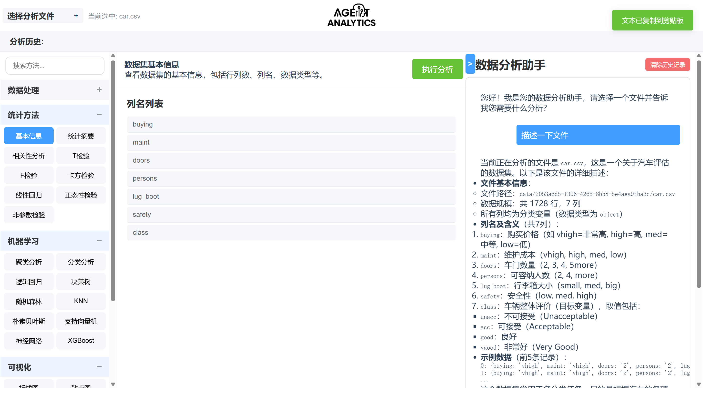
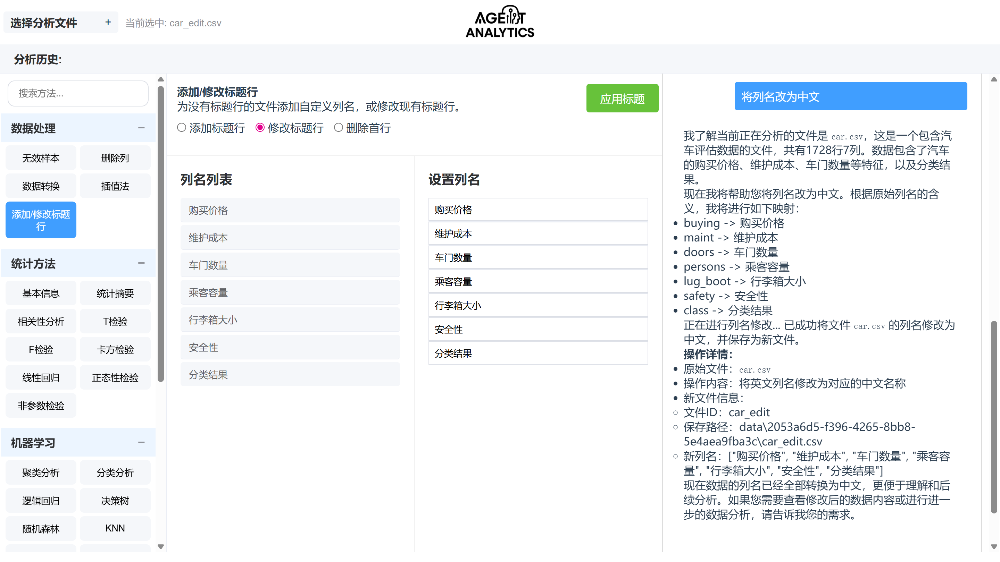
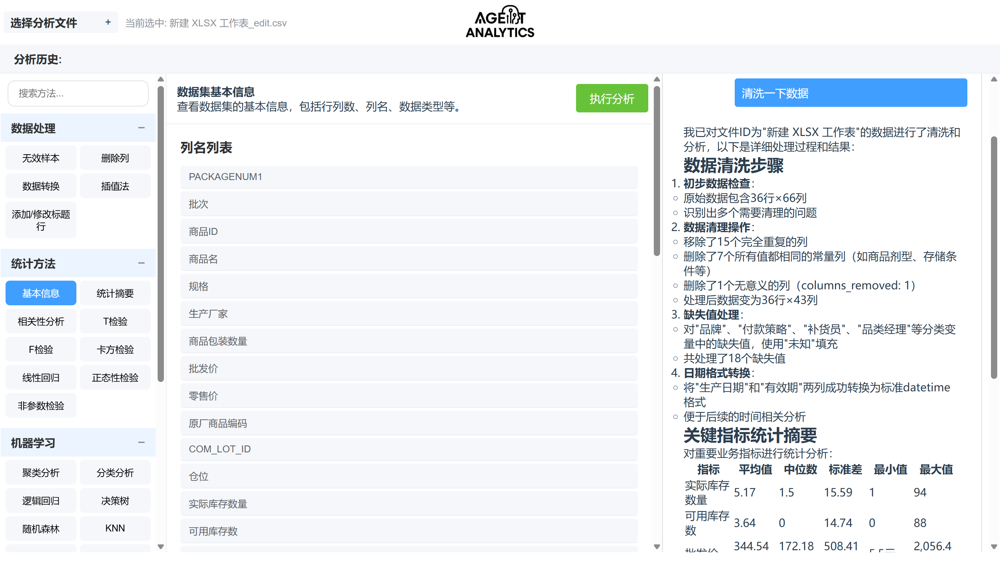
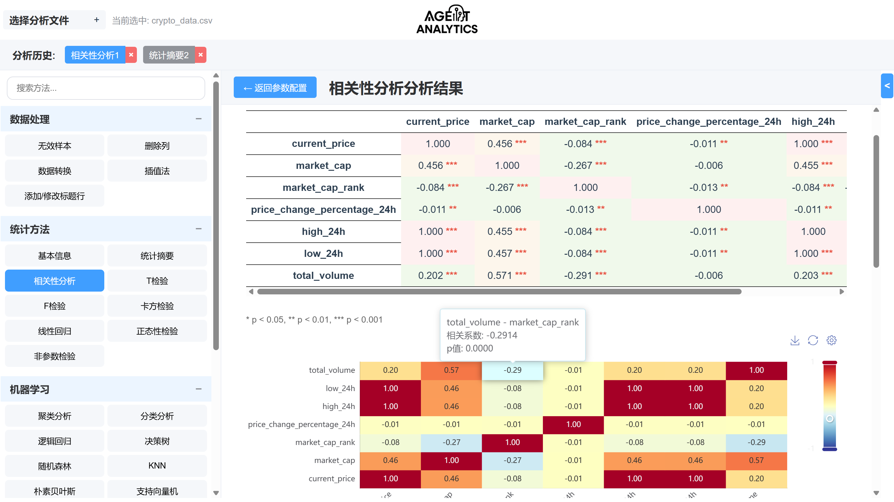
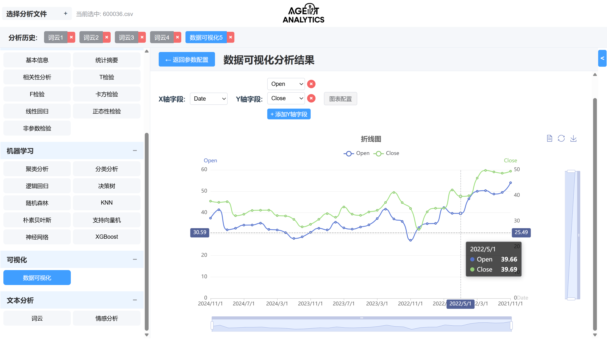

<div align="center">

# Agent-Analytics: 基于LLM-Agent的数据分析与报告生成系统


</div>

## 项目简介

Agent-Analytics 是一个基于大语言模型（LLM）Agent 的自适应数据分析与报告生成系统，旨在通过智能代理技术实现自动化数据处理、分析与可视化报告输出。

该系统能够以可视化、0代码方式实现数据清洗、统计建模、机器学习、数据可视化等多种用途，并利用 LLM 进行报告产出、自然语言交互、提些建议。

## 应用展示

#### Agent对话


#### 工具调用


#### 工具链调用


#### 分析渲染


#### 可视化


#### 文本分析


## 系统架构图


## 系统目录结构

```bash
project/
├── backend/
│   ├── main.py              # FastAPI主程序
│   ├── agents/              # Agent实现
│   ├── routers/             # 路由定义
│   │   ├── chat.py          # 聊天相关接口
│   │   ├── data.py          # 数据处理接口
│   │   └── files.py         # 文件管理接口
│   ├── tools/               # 工具API
│   │   ├── ml_api/          # 机器学习API
│   │   ├── nlp_api/         # 自然语言处理API
│   │   └── pandas_api/      # 数据处理API
│   ├── reports/             # 报告生成
│   └── utils/               # 工具函数
│       ├── cleanup.py       # 清理工具
│       └── file_manager.py  # 文件管理工具
├── frontend/
│   └── src/
│       ├── views/
│       │   ├── Dashboard.vue # 主界面
│       │   ├── Preview.vue  # 预览界面
│       │   └── Upload.vue   # 上传界面
│       ├── router/          # 路由配置
│       └── main.js          # 入口文件
├── README.md
└── requirements.txt
```

## 数据流通逻辑

1. 用户上传数据文件（CSV/XLS/XLSX）
2. 后端保存至`data/`目录，并关联唯一session_id
3. 用户通过聊天界面输入自然语言指令
4. LLM解析意图并指导Agent调用相应Tool执行分析
5. Tool返回结果（DataFrame、模型评估、图表等）
6. Agent总结结果，生成文字报告
7. 前端展示图表与自然语言报告

## 安全与性能特性

* 支持多种数据格式上传（CSV、XLS、XLSX）
* 基于Session的会话管理，隔离不同用户数据
* 定期自动清理过期会话和文件，节省存储空间
* 异步文件处理，提高响应速度

## 快速开始

### 后端启动

1. 安装依赖：
```bash
pip install -r requirements.txt
```

2. 设置环境变量（使用通义千问）：
```bash
export DASHSCOPE_API_KEY=你的API密钥
```

3. 运行后端服务：
```bash
python backend/main.py
```

### 前端启动

1. 安装依赖：
```bash
cd frontend
npm install
```

2. 运行前端开发服务器：
```bash
npm run server
```

3. 访问 http://localhost:5173 查看应用

## 开发路线图

- [x] 基础文件上传功能
- [x] 实现基础数据分析 API
- [x] 添加数据可视化功能
- [x] 实现自然语言交互
- [ ] 自动生成分析报告
- [ ] 集成更多机器学习算法
- [ ] 支持更多文件格式
- [ ] 增强报告模板功能
- [ ] 添加用户认证和权限管理

## Languages
Total : 78 files,  14038 codes, 1488 comments, 1887 blanks, all 17413 lines

| language   | files |   code | comment | blank |  total |
|:-----------|------:|-------:|--------:|------:|-------:|
| vue        |    34 | 10,992 |      78 | 1,207 | 12,277 |
| Python     |    18 |  2,296 |   1,300 |   558 |  4,154 |
| JavaScript |     9 |    408 |     102 |    62 |    572 |