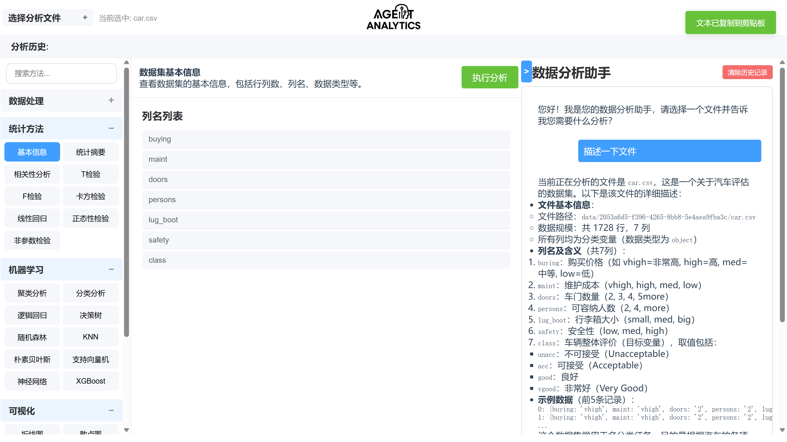
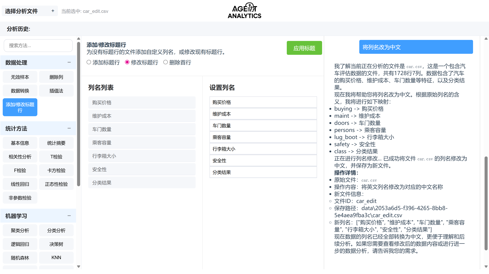
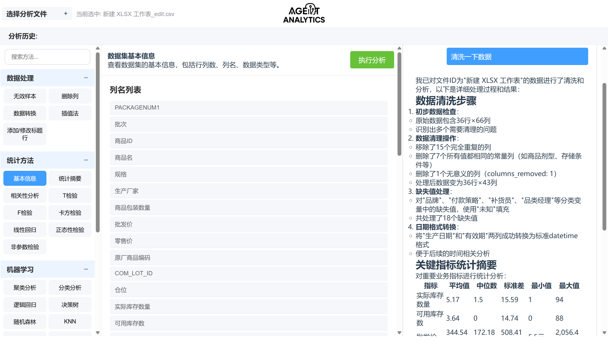
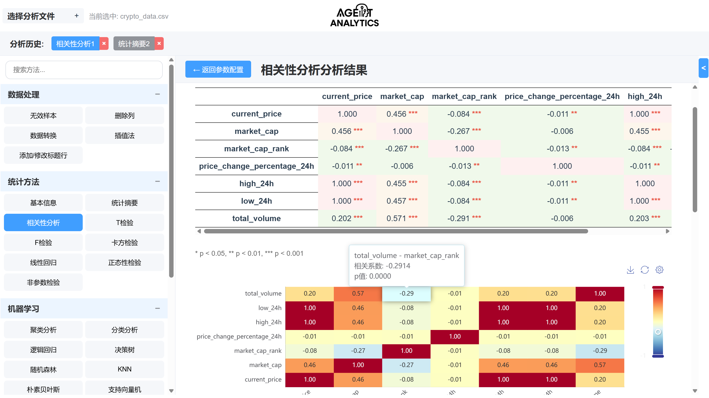
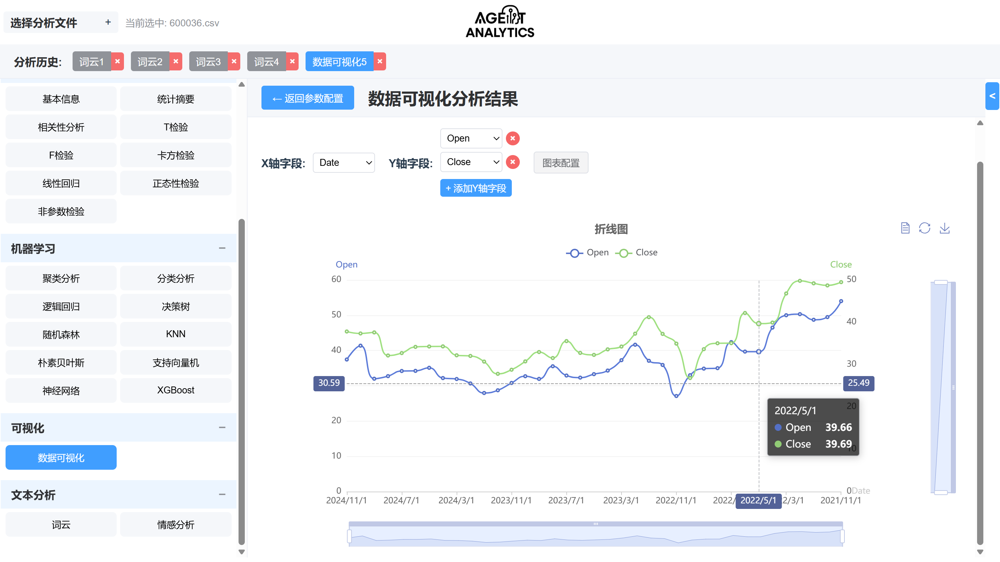
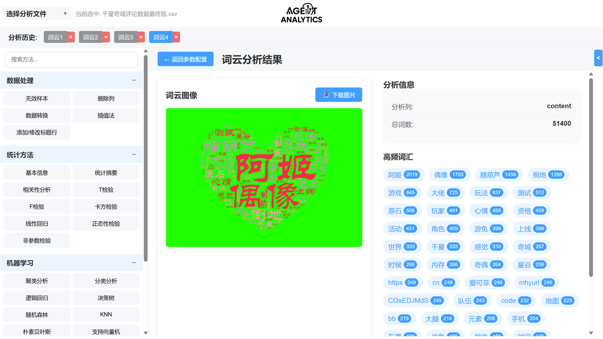

<div align="center">

# Agent-Analytics: LLM-Agent Based Data Analysis and Report Generation System


</div>

[中文](README.md)

## Project Introduction

Agent-Analytics is an adaptive data analysis and report generation system based on Large Language Model (LLM) Agents, designed to achieve automated data processing, analysis, and visualized report output through intelligent agent technology.

The system can visualize and implement data cleaning, statistical modeling, machine learning, data visualization and other functions in a zero-code manner, and utilize LLM for report generation, natural language interaction, and suggestions.

## Application Demo

[👉Example Demo](example.md)

#### Agent Conversation


#### Tool Invocation


#### Tool Chain Invocation


#### Analysis Rendering


#### Visualization


#### Text Analysis


## System Architecture Diagram


## System Directory Structure

```bash
project/
├── backend/
│   ├── main.py              # FastAPI main program
│   ├── agents/              # Agent implementation
│   │   ├── tools/           # Agent tool APIs
│   │   └── reports/         # Report generation
│   ├── routers/             # Route definitions
│   │   ├── analysis.py      # Analysis related interfaces
│   │   ├── charts.py        # Chart related interfaces
│   │   ├── chat.py          # Chat related interfaces
│   │   ├── data.py          # Data processing interfaces
│   │   ├── files.py         # File management interfaces
│   │   └── nlp.py           # NLP related interfaces
│   └── utils/               # Utility functions
│       ├── file_manager.py  # File management tools
│       ├── ml_tool/         # Machine learning tool package
│       ├── nlp_tool/        # NLP tool package
│       └── pandas_tool/     # Pandas tool package
├── frontend/
│   └── src/
│       ├── views/
│       │   ├── Dashboard.vue # Main interface
│       │   ├── Preview.vue  # Preview interface
│       │   └── Upload.vue   # Upload interface
│       ├── router/          # Routing configuration
│       └── main.js          # Entry file
├── README.md
└── requirements.txt
```

## Data Flow Logic

1. User uploads data files (CSV/XLS/XLSX)
2. Backend saves to `data/` directory and associates with unique session_id
3. User inputs natural language commands through chat interface
4. LLM parses intent and guides Agent to call appropriate Tools for analysis
5. Tools return results (DataFrame, model evaluation, charts, etc.)
6. Agent summarizes results and generates text reports
7. Frontend displays charts and natural language reports

## Security and Performance Features

* Supports multiple data format uploads (CSV, XLS, XLSX)
* Session-based session management isolates different user data
* Regular automatic cleanup of expired sessions and files saves storage space
* Asynchronous file processing improves response speed

## Quick Start

### Electron Local Test Version Now Available

https://github.com/746505972/agent-analytics/releases/latest

---

### Backend Setup

1. Install dependencies:
```bash
pip install -r requirements.txt
```

2. Set environment variables (using Qwen):
```bash
export DASHSCOPE_API_KEY=your_api_key
```

3. Run backend service:
```bash
python backend/main.py
```

### Frontend Setup

1. Install dependencies:
```bash
cd frontend
npm install
```

2. Run frontend development server:
```bash
npm run server
```

3. Visit http://localhost:5173 to view the application

## Languages
Total : 153 files,  31024 codes, 3156 comments, 3982 blanks, all 38162 lines

| language   | files |   code | comment | blank |  total |
|:-----------|------:|-------:|--------:|------:|-------:|
| vue        |    76 | 23,202 |     257 | 2,459 | 25,918 |
| Python     |    42 |  6,121 |   2,693 | 1,283 | 10,097 |
| JavaScript |    16 |  1,154 |     197 |   124 |  1,475 |
