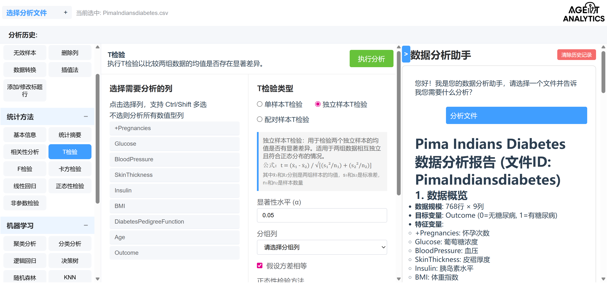

### 1.用户提出任务

### 2.Agent完成任务链👇

# Pima Indians Diabetes 数据分析报告 (文件ID: PimaIndiansdiabetes)

## 1. 数据概览
- **数据规模**: 768行 × 9列
- **目标变量**: Outcome (0=无糖尿病, 1=有糖尿病)
- **特征变量**:
  - +Pregnancies: 怀孕次数
  - Glucose: 葡萄糖浓度
  - BloodPressure: 血压
  - SkinThickness: 皮褶厚度
  - Insulin: 胰岛素水平
  - BMI: 体重指数
  - DiabetesPedigreeFunction: 糖尿病家族史函数
  - Age: 年龄

## 2. 描述性统计分析

### 主要统计指标
| 变量                       | 均值     | 标准差    | 最小值  | 最大值  | 中位数   |
|--------------------------|--------|--------|------|------|-------|
| +Pregnancies             | 3.85   | 3.37   | 0    | 17   | 3.0   |
| Glucose                  | 120.89 | 31.97  | 0    | 199  | 117.0 |
| BloodPressure            | 69.11  | 19.36  | 0    | 122  | 72.0  |
| SkinThickness            | 20.54  | 15.95  | 0    | 99   | 23.0  |
| Insulin                  | 79.80  | 115.24 | 0    | 846  | 30.5  |
| BMI                      | 31.99  | 7.88   | 0    | 67.1 | 32.0  |
| DiabetesPedigreeFunction | 0.47   | 0.33   | 0.08 | 2.42 | 0.37  |
| Age                      | 33.24  | 11.76  | 21   | 81   | 29.0  |

### 分布特征
- **偏度分析**: 多数变量呈现右偏分布，特别是Insulin(偏度=2.27)、DiabetesPedigreeFunction(偏度=1.92)和Age(偏度=1.13)
- **峰度分析**: Insulin和BloodPressure等变量具有较高的峰度，表明分布具有较尖的峰和厚尾
- **正态性检验**: 所有连续变量的Shapiro-Wilk检验p值均<0.05，拒绝正态分布假设

## 3. 相关性分析

### Pearson相关系数矩阵
- **强相关性**(>0.4):
  - SkinThickness与Insulin: r=0.44
  - SkinThickness与BMI: r=0.39
  - Glucose与Insulin: r=0.33
  - Glucose与BMI: r=0.22

- **中等相关性**(0.2-0.4):
  - BloodPressure与BMI: r=0.28
  - Glucose与Age: r=0.26
  - +Pregnancies与Age: r=0.54 (最强线性关系)

### 显著性发现
所有提到的相关性在α=0.05水平下均显著(p<0.05)，除了+Pregnancies与BMI、DiabetesPedigreeFunction之间的相关性不显著。

## 4. 组间差异分析 (Outcome分组)

### 方差分析(ANOVA)
- **显著差异**(p<0.05):
  - +Pregnancies (p=5.07e-10)
  - Glucose (p=8.94e-43)
  - SkinThickness (p=0.038)
  - Insulin (p=2.86e-4)
  - BMI (p=1.23e-16)
  - DiabetesPedigreeFunction (p=1.25e-6)
  - Age (p=2.21e-11)

- **非显著差异**:
  - BloodPressure (p=0.072)

### Mann-Whitney U检验 (非参数方法)
由于数据不服从正态分布，使用非参数检验验证结果：
- **显著差异**(p<0.05):
  - +Pregnancies (p=3.75e-8)
  - Glucose (p=1.20e-39)
  - BloodPressure (p=7.56e-5)
  - SkinThickness (p=0.013)
  - BMI (p=9.73e-18)
  - DiabetesPedigreeFunction (p=1.20e-6)
  - Age (p=1.14e-17)

- **非显著差异**:
  - Insulin (p=0.066)

### 卡方检验 (+Pregnancies分类变量)
对怀孕次数进行独立性检验，结果显示其与糖尿病状况存在显著关联(χ²=64.59, p=8.65e-8)。

## 5. 线性回归分析

以Outcome为因变量，其他变量为自变量建立线性回归模型：

### 模型性能
- R² = 0.303
- RMSE = 0.398
- MAE = 0.332

### 回归系数
| 变量                       | 系数     | 影响方向 |
|--------------------------|--------|------|
| 截距                       | -0.854 |      |
| +Pregnancies             | 0.021  | 正向   |
| Glucose                  | 0.006  | 正向   |
| BloodPressure            | -0.002 | 负向   |
| SkinThickness            | 0.000  | 微弱正向 |
| Insulin                  | -0.000 | 负向   |
| BMI                      | 0.013  | 正向   |
| DiabetesPedigreeFunction | 0.147  | 正向   |
| Age                      | 0.003  | 正向   |

## 6. 结论与建议

### 主要发现
1. **关键预测因子**: Glucose(血糖)是最重要的预测变量，其次是DiabetesPedigreeFunction(家族史)和BMI。
2. **年龄效应**: 年龄与糖尿病风险呈显著正相关，且糖尿病患者平均年龄更高(37.1 vs 31.2岁)。
3. **代谢指标**: BMI和SkinThickness等肥胖相关指标在糖尿病患者中显著更高。
4. **妊娠次数**: 糖尿病患者的妊娠次数更多(4.87 vs 3.30次)。

### 实际意义
- 血糖控制是预防糖尿病的关键
- 体重管理(BMI)对于降低糖尿病风险至关重要
- 家族遗传因素具有重要影响
- 高龄和多次妊娠可能是糖尿病的风险因素

### 局限性
1. 数据中存在零值异常(如Glucose=0)，可能表示缺失值而非真实测量值
2. 线性模型解释力有限(R²=0.303)，建议尝试逻辑回归或其他分类算法
3. 变量间存在多重共线性，可能影响回归系数的稳定性

建议后续进行数据清洗(处理零值异常)并尝试更适合二分类问题的机器学习模型。